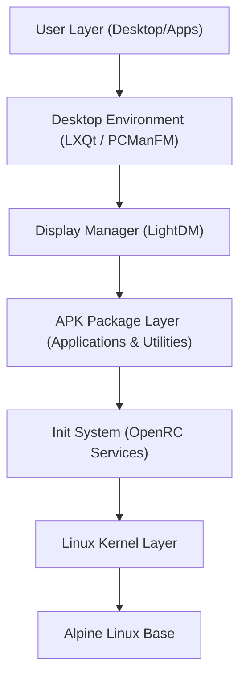

# NovaOS - Lightweight Linux Distribution

NovaOS is a lightweight, modern, and user-friendly Linux-based operating system designed for everyday users, students, and developers. Built on top of **Alpine Linux**, NovaOS aims to provide a fast and resource-efficient computing environment while delivering a complete and modern desktop experience comparable to mainstream distributions like Windows or Ubuntu.

---

## 🌟 Project Vision

To build a modern Linux distribution that is:
* 🪶 **Lightweight & Fast**: Booting in seconds, using minimal CPU and RAM at idle.
* 💻 **User & Developer Friendly**: Preconfigured with robust development tools and a clean desktop.
* 📦 **Easy to Install**: Straightforward installation pathways (initially for virtualized environments).
* 🎨 **Highly Customizable**: Clean separation of configurations, themes, and branding.
* 🔓 **Fully Open Source**: Built entirely with open-source components and philosophies.

---

## ⚙️ Technical Stack

The core components of NovaOS are selected for their stability, low resource footprint, and ease of customizability.

| Component | Technology | Description / Rationale |
| :--- | :--- | :--- |
| **Base Distribution** | [Alpine Linux](https://alpinelinux.org/) | Minimalist, security-oriented, based on musl libc and BusyBox. |
| **Linux Kernel** | Linux Kernel (vanilla/lts) | Standard LTS kernel for broad hardware/VM compatibility. |
| **Init System** | OpenRC | Dependency-based init system, simpler and lighter than systemd. |
| **Package Manager** | `apk` (Alpine Package Keeper) | Extremely fast dependency resolution and package installation. |
| **Desktop Environment**| LXQt | Lightweight Qt desktop environment that uses very little RAM. |
| **Display Manager** | LightDM | Cross-desktop display manager providing a clean login interface. |
| **File Manager** | PCManFM-Qt | Fast, lightweight file manager with tabbed browsing. |
| **Terminal Emulator** | xfce4-terminal | Modern, customizable terminal with low overhead. |
| **Web Browser** | Firefox | Secure, feature-rich web browser for day-to-day use. |

---

## 🎯 Performance Goals

| Metric | Target |
| :--- | :--- |
| **ISO Size** | < 1.5 GB |
| **Idle RAM Usage** | 300 - 600 MB |
| **Boot Time** | < 15 seconds (in virtualized environments) |
| **Idle CPU Usage** | < 5% |

---

## 🗺️ System Architecture

NovaOS leverages a layered system architecture, keeping configurations and visual modifications separated from the base Alpine system:



---

## 📂 Directory Structure

The repository is structured to separate branding, configuration, themes, and installation helpers:

```text
novaos/
├── branding/     # Logos, icons, boot animations, and OS info files
├── build/        # Staging area for building the custom ISO
├── configs/      # Configuration files (OpenRC, LightDM, LXQt, etc.)
├── docs/         # Setup guides, milestone logs, and technical notes
├── installer/    # Custom installers and post-installation scripts
├── packages/     # Local APKBUILD scripts and custom built packages
├── scripts/      # Automation, building, and ISO generation scripts
├── themes/       # Desktop stylesheets, window managers, and icon themes
├── wallpapers/   # Default wallpaper sets
├── releases/     # Output directory for release-ready bootable ISOs
└── README.md     # Project overview and coordination documentation
```

---

## 🚀 Roadmap

* **v1.0 (Current Phase)**: Bootable ISO, desktop interface (LXQt), Web Browser (Firefox), Terminal, network (WiFi/Ethernet), Bluetooth, and Package Management.
* **v1.5**: Enhanced setting applications, customized desktop themes, custom branding, and performance optimizations.
* **v2.0**: Custom OS installer, system update manager, plug-and-play driver support, security hardening, and desktop plugins.

---

## 🛠️ Development Principles

1. **Lightweight over Bloated**: Every added package must be evaluated. If a package is not strictly necessary for a modern desktop experience, it should not be in the default image.
2. **Stability over Bleeding-Edge**: Use LTS kernels and stable package branches to prevent regressions.
3. **Performance First**: Idle resource use is our baseline metric. Keep runlevels clean.
4. **Modern UI Aesthetics**: A lightweight desktop doesn't have to look ancient. We utilize modern fonts, clean widget stylesheets, and coordinated color palettes.
5. **Open Source by Default**: All scripts, configurations, and documentation must be licensed under open-source licenses.
